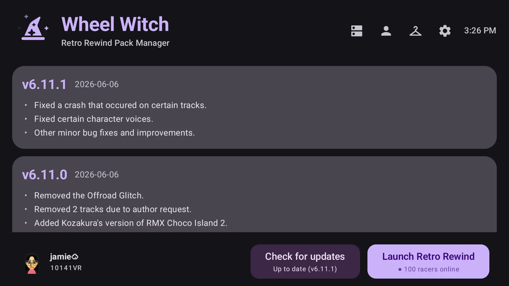
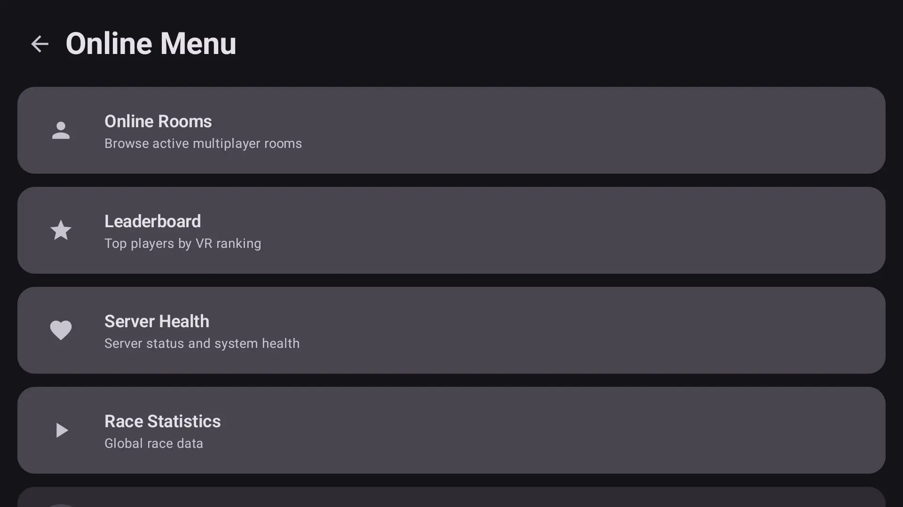
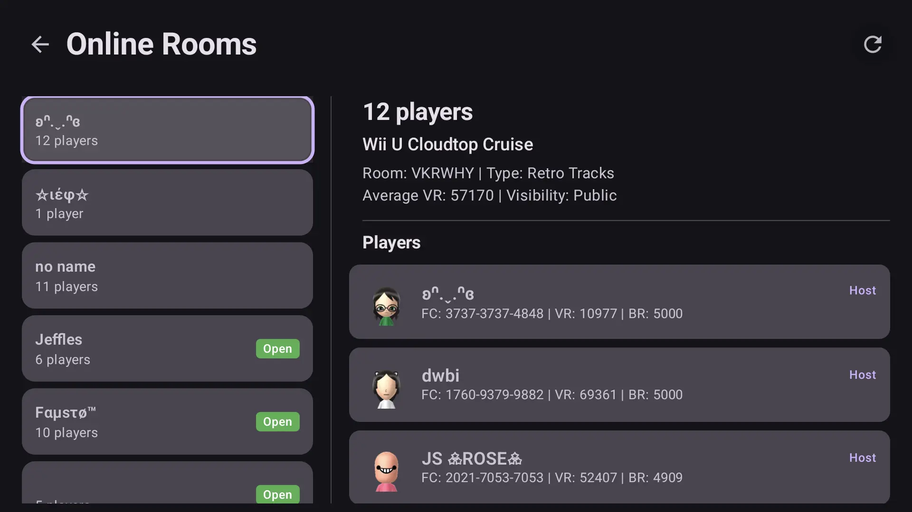
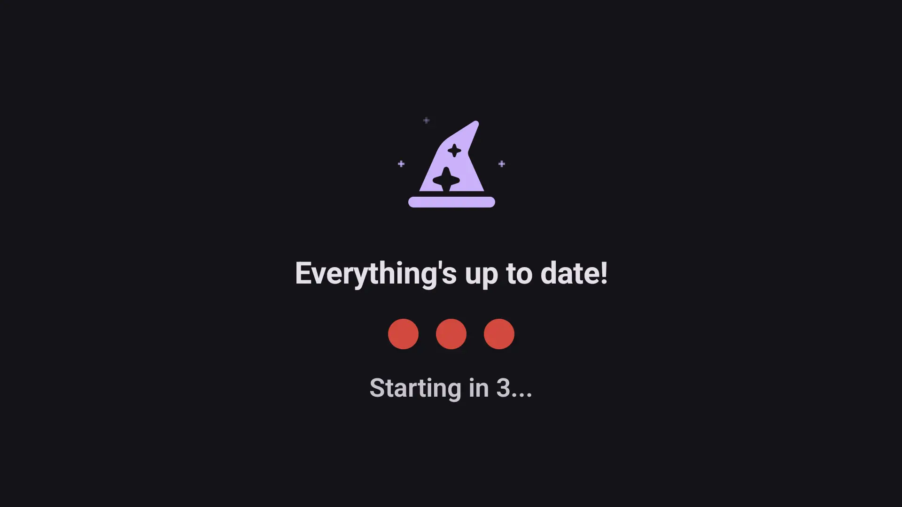
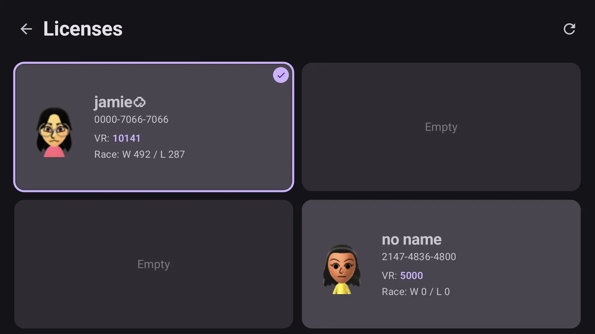
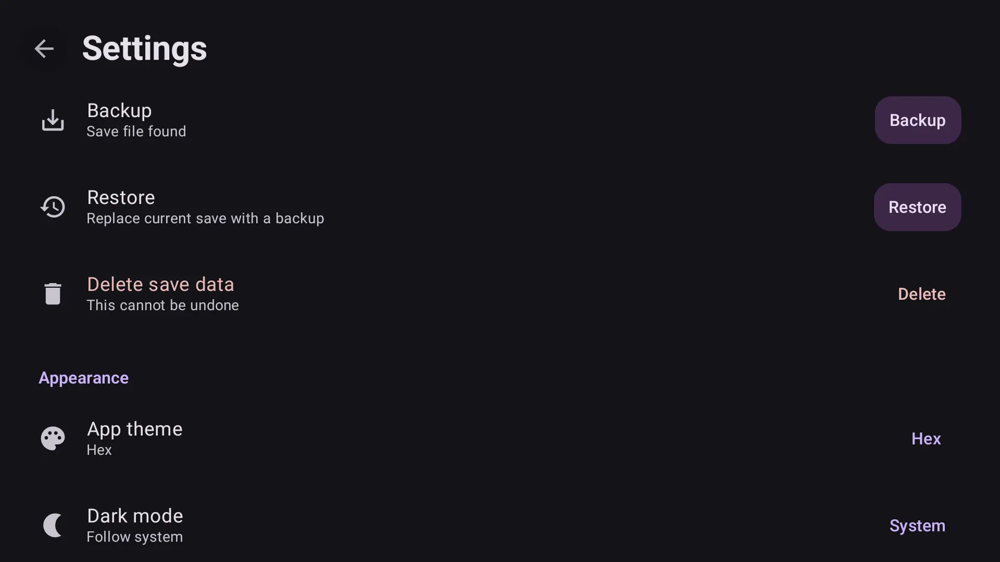
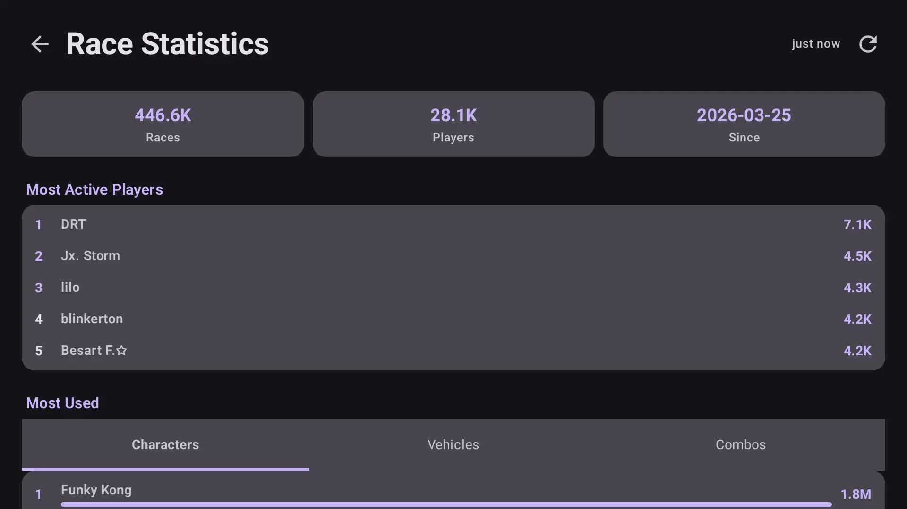

  

<h1 align="center">Wheel Witch</h1>

 

  &nbsp;
  &nbsp;
  &nbsp;
  &nbsp;
  

 

  &nbsp;&nbsp;
  <a href="https://apps.obtainium.imranr.dev/redirect?r=obtainium://app/%7B%22id%22%3A%22com.skiletro.wheelwitch%22%2C%22url%22%3A%22https%3A%2F%2Fgithub.com%2Fskiletro%2FWheelWitch%22%2C%22author%22%3A%22skiletro%22%2C%22name%22%3A%22WheelWitch%22%2C%22additionalSettings%22%3A%22%7B%5C%22includePrereleases%5C%22%3Atrue%2C%5C%22apkFilterRegEx%5C%22%3A%5C%22wheelwitch-.%2A%5C%5C%5C%5C.apk%5C%22%2C%5C%22versionExtractionRegEx%5C%22%3A%5C%22%28%5C%5C%5C%5Cd%2B%5C%5C%5C%5C.%5C%5C%5C%5Cd%2B%5C%5C%5C%5C.%5C%5C%5C%5Cd%2B%29%5C%22%2C%5C%22releaseTitleAsVersion%5C%22%3Atrue%7D%22%7D"></a>

## Screenshots

| Home | Online Menu | Online Rooms |
|------|-------------|--------------|
|  |  |  |

| Quick Launch | Licenses | Settings |
|--------------|----------|----------|
|  |  |  |

| Race Stats | | |
|------------|---|---|
|  |  |  |

## About

Wheel Witch is an Android companion app for [Retro Rewind](https://wiki.tockdom.com/wiki/Retro_Rewind), a custom Mario Kart Wii distribution.
It downloads and incrementally updates the pack from the RWFC server, then launches Dolphin with the pack pre-loaded.

## Features

- One-tap full install + incremental updates
- Save data (license) backup/restore via file picker
- Live in-app leaderboard, online rooms, server health, race stats
- Home-screen quick launch shortcut
- On-device Mii Channel WAD installer from GameBanana
- Multiple themes including Material You dynamic colour, with dark, light, and system modes

> [!NOTE]
> Save backup/restore currently only supports the **PAL** version of Mario Kart Wii (`RMCP`). - see [TODO](#todo)

## Download

The latest signed release APK is built automatically on every push to `master` and published as a [pre-release](https://github.com/skiletro/WheelWitch/releases/tag/latest) with auto-generated changelog. You can also install it via [Obtainium](https://github.com/ImranR98/Obtainium) by importing the config from the button above.

To build from source or contribute, see [CONTRIBUTING.md](CONTRIBUTING.md#build).

## Requirements

- Android 12+ (API 31)
- [Dolphin Emulator](https://dolphin-emu.org) installed
- Mario Kart Wii ISO

## First Time Setup

1. Open the app, tap **Select Storage Folder** to choose where the pack files go
2. After installing the pack, select your Mario Kart Wii ISO when prompted
3. Tap **Launch Dolphin**

For returning users, the gear icon opens Settings, and the **Quick Launch** section lets you pin a home-screen shortcut that skips onboarding entirely.

## Building & Contributing

See [CONTRIBUTING.md](CONTRIBUTING.md) for build instructions, signing setup, and contribution guidelines.

## TODO

Back up `wc24scr.vff`

  Mario Kart Wii's Wiimmfi world rankings cache. Either copy the file or
  back up the whole `RMCP` folder, mirroring how `rksys.dat` is handled
  in `SaveManager`.

Support other RMCx save types

  Only `RMCP` (PAL) is currently supported. `RMCE` (USA), `RMCJ` (JPN),
  and `RMCK` (KOR) need the same treatment. Could detect by sniffing the
  first bytes of the save or by following the storage folder name.

Disable license button when no licenses exist

  Gate the licenses shortcut on `SaveDataViewModel.hasSave.collectAsState()`.
  If false, render the button disabled with a "no save" subtitle rather
  than letting the user tap into a broken Licenses screen.

Fix logo animation speed varying by device

  Current animation is frame-driven so the rotation speed depends on
  display refresh rate. Use a time-based source (e.g. `Animatable` with a
  fixed duration) for frame-rate-independent motion.

Smooth out the downloading/extract progress bar

  `ProgressInfo.Downloading` events fire at ~1% intervals, producing solid
  steps. Animate between values with `animateFloatAsState` inside the
  progress bar composable for a continuous feel.

Fix static Quick Launch shortcut hardcoding the release applicationId

  On debug builds (applicationId `com.skiletro.wheelwitch.debug`), the
  long-press-app-icon shortcut launches the release build instead. The
  dynamic pin in Settings works correctly. Drop `targetPackage` and
  `targetClass` from `shortcuts.xml` so the system resolves within the
  declaring package. Note: `${applicationId}` does not work in `res/xml/`
  so a string resource is needed for the static action.

## Credits

- **[Retro Rewind](https://rwfc.net)** and the **[Wheel Wizard](https://github.com/TeamWheelWizard/WheelWizard)** team for the pack format and update server
- **[Dolphin Emulator](https://dolphin-emu.org)**
- **[Tockdom wiki](https://wiki.tockdom.com)**
- **[Chadderz](https://chadsoft.co.uk/contact.html)** for her [Terrible Mario Kart Font](https://wiki.tockdom.com/wiki/CTMKF)
- **[Jetpack Compose](https://developer.android.com/jetpack/compose)**, **[Material 3](https://m3.material.io)**, and **[OkHttp](https://square.github.io/okhttp/)** for the building blocks
- **[Obtainium](https://github.com/ImranR98/Obtainium)** for making sideloaded auto-updates painless
- **[Composables](https://composables.com/)** for the cool icons

This project is unaffiliated with Nintendo, Retro Rewind, or Wheel Wizard.
Rights to Mario Kart Wii go to Nintendo, Retro Rewind to the Retro Rewind Team, and Wheel Wizard to the Wheel Wizard team.

> [!IMPORTANT]
> Parts of this codebase were written with assistance from [MiniMax M3](https://minimax.io) and [GLM-4.7](https://z.ai) as a way to get more familiar with AI tooling.
> It was especially useful for writing test cases and porting save-related logic from the original Wheel Wizard project.
> I'm always open to conversation about AI in development and I believe it would have been disingenuous to omit the fact that it was used; I see these tools as a way to help write code, not a replacement for understanding what you're building.
> They should be used with care and in moderation.
>
> Small disclaimer over. Please don't hate me. :(
