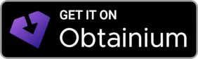

<p align="center">
  
</p>

<h1 align="center">Wheel Witch</h1>

<p align="center">
  Downloads/updates the Retro Rewind Mario Kart Wii Pack and launches Dolphin Emulator.
</p>

<p align="center">
  
  
  
  
</p>

## About

Wheel Witch is a sideloaded Android companion app for [Retro Rewind](https://wiki.tockdom.com/wiki/Retro_Rewind), a custom Mario Kart Wii distribution. It downloads and incrementally updates the pack from the same server WheelWizard uses, then launches Dolphin Emulator with the pack pre-loaded.

This is **not** a replacement for WheelWizard's PC tool — it's a phone-first way to keep your Wii's pack install fresh without booting a desktop.

## Screenshots

| Home | Online Menu | Quick Launch |
|------|-------------|--------------|
|  |  |  |

| Licenses | Settings | Race Stats |
|----------|----------|------------|
|  |  |  |

Drop PNGs into `docs/screenshots/` to fill in the placeholders.

## Features

- One-tap full install + incremental updates
- Save data (license) backup/restore via file picker
- Live in-app leaderboard, online rooms, server health, race stats
- Home-screen quick launch shortcut
- On-device Mii Channel WAD installer from GameBanana
- Multiple themes including Material You dynamic colour, with dark, light, and system modes

## Download

<p align="center">
  <a href="https://github.com/skiletro/WheelWitch/releases/tag/latest"></a>
  <a href="#"></a>
</p>

The latest signed release APK is built automatically on every push to `main`
and published as a [pre-release](https://github.com/skiletro/WheelWitch/releases/tag/latest)
with auto-generated changelog. You can also trigger a build manually from the
[Actions tab](https://github.com/skiletro/WheelWitch/actions).

Or [build from source](#build) with Gradle.

## Build

```bash
./gradlew assembleDebug                  # build APK
./gradlew assembleRelease                # release build (R8/ProGuard)
./gradlew testDebugUnitTest              # run unit tests
```

The debug APK lands at `app/build/outputs/apk/debug/app-debug.apk`.

For a **signed release APK**, set these environment variables and run
`./gradlew assembleRelease`:

```bash
export KEYSTORE_PATH=./release.keystore
export KEYSTORE_PASSWORD=your-store-pass
export KEY_ALIAS=wheelwitch
export KEY_PASSWORD=your-key-pass
```

Run `scripts/setup-signing.sh` to generate a keystore interactively.

## Requirements

- Android 12+ (API 31)
- [Dolphin Emulator](https://dolphinemu.com) installed
- Mario Kart Wii ISO

## First Time Setup

1. Open the app, tap **Select Storage Folder** to choose where the pack files go
2. After installing the pack, select your Mario Kart Wii ISO when prompted
3. Tap **Launch Dolphin**

For returning users, the gear icon opens Settings, and the **Quick Launch** section lets you pin a home-screen shortcut that skips onboarding entirely.

## Contributing

1. Fork this repository
2. Create a feature branch (`git checkout -b fix-the-thing`)
3. Commit your changes with a conversational message (e.g. `add the widget`, `fix the bobble`) — match the existing style
4. Open a pull request

Build gates: `./gradlew assembleDebug testDebugUnitTest` must stay green. No formal CLA; if you contribute code, please add yourself to a credits section if we add one.

## Credits

- **[Retro Rewind](https://wiki.tockdom.com/wiki/Retro_Rewind)** and the **Wheel Wizard** team for the pack format and update server
- **[Dolphin Emulator](https://dolphinemu.org)** for the runtime
- **[Tockdom wiki](https://wiki.tockdom.com)** for the changelog source
- **[Jetpack Compose](https://developer.android.com/jetpack/compose)**, **[Material 3](https://m3.material.io)**, and **[OkHttp](https://square.github.io/okhttp/)** for the building blocks
- **[Obtainium](https://github.com/ImranR98/Obtainium)** for making sideloaded auto-updates painless

Nintendo owns Mario Kart Wii. This project is unofficial and not affiliated with Nintendo.
